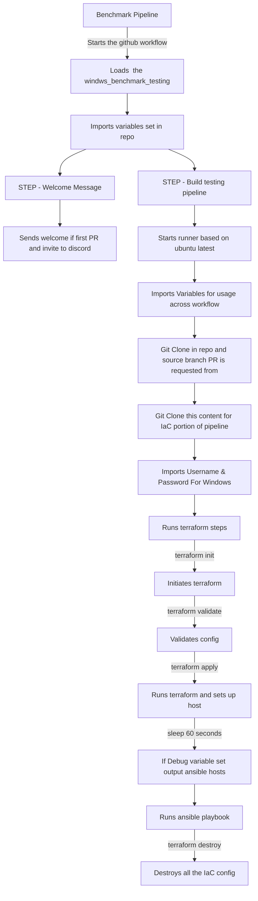

# Github Windows IaC

terraform workflow files for use with the LE windows based pipelines

## Requirements

Each repo needs to have the following variables set
repository variables required - settings/actions/variables

- OSVARS ( Valid variables below )
  - WIN10
  - WIN11
  - WIN2016
  - WIN2019
  - WIN2022

- BENCHMARK_TYPE ( Valid variables below )
  - CIS
  - STIG

eg.

```shell
OSVARS WIN2019
BENCHMARK_TYPE CIS
```

## Overview

This is called by the repository workflow to pull in this content.
This enables us to manage the workflow and IAC centrally, enabling us to quickly change anything for improvements of issues with a certain region.



# Run locally

```shell
$ export BENCHMARK_TYPE="CIS"
$ export OSVAR="WIN2019"
$ export TF_VAR_repository="${OSVAR}-${benchmark_type}"
$ export TF_VAR_BENCHMARK_TYPE="${benchmark_type}"

$ terraform apply -var-file "${OSVAR}.tfvars" --auto-approve
$ terraform destroy -var-file "${OSVAR}.tfvars" --auto-approve
```
